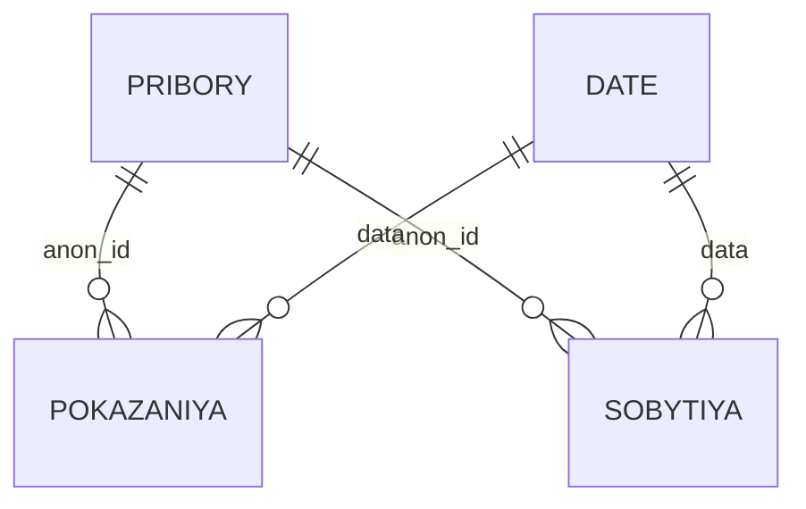

# Power BI dashboard concept

## Goal

The dashboard should answer one operational question quickly: **which meters need attention first, and why?**

## Data model



For monitoring, `results/device_anomaly_flags.csv` can be loaded as a ready-made device-level anomaly mart.

## Page 1 — Monitoring overview

```text
+--------------------------------------------------------------------------------+
| Filters: Date | BS | Type | Model | anon_id | Anomaly type                    |
+--------------------------------------------------------------------------------+
| 3000 devices | Devices with anomalies | Unrealistic | Leak | Zero | Magnet     |
+--------------------------------------------------------------------------------+
| Devices by anomaly type                 | Daily consumption of selected meter   |
| [horizontal bar chart]                  | [line chart by date]                  |
|                                         | markers: spike / negative / magnet    |
+--------------------------------------------------------------------------------+
| Priority devices: anon_id | BS | type | anomaly | max/streak | status          |
+--------------------------------------------------------------------------------+
```

### Recommended visuals

1. **KPI cards** — total devices, devices with any anomaly, unrealistic values, leak candidates, zero-consumption candidates.
2. **Bar chart** — number of devices by anomaly type.
3. **Line chart** — daily consumption for selected `anon_id`; add event markers for `магнит`.
4. **Priority table** — sortable list of devices requiring investigation.
5. **Slicers** — date, BS, type, model, anon_id, anomaly type.

## Page 2 — Device diagnostics

For one selected `anon_id`:

- daily consumption trend;
- accumulated reading trend;
- packets per day;
- event timeline (`магнит`, `сброс`, `Холл`);
- anomaly flags and longest streaks;
- metadata: BS, type, model, production month.

## Useful Power BI measures

```DAX
Devices = DISTINCTCOUNT(device_anomaly_flags[anon_id])

Devices With Any Anomaly =
CALCULATE(
    DISTINCTCOUNT(device_anomaly_flags[anon_id]),
    FILTER(
        device_anomaly_flags,
        device_anomaly_flags[negative_flag] = 1 ||
        device_anomaly_flags[absolute_spike_flag] = 1 ||
        device_anomaly_flags[relative_spike_flag] = 1 ||
        device_anomaly_flags[unrealistic_flag] = 1 ||
        device_anomaly_flags[leak_flag] = 1 ||
        device_anomaly_flags[zero_flag] = 1 ||
        device_anomaly_flags[step_flag] = 1
    )
)
```

The most important visual is the **daily consumption line chart for a selected meter**, because it makes spikes, falls, zero periods and step changes immediately visible.
